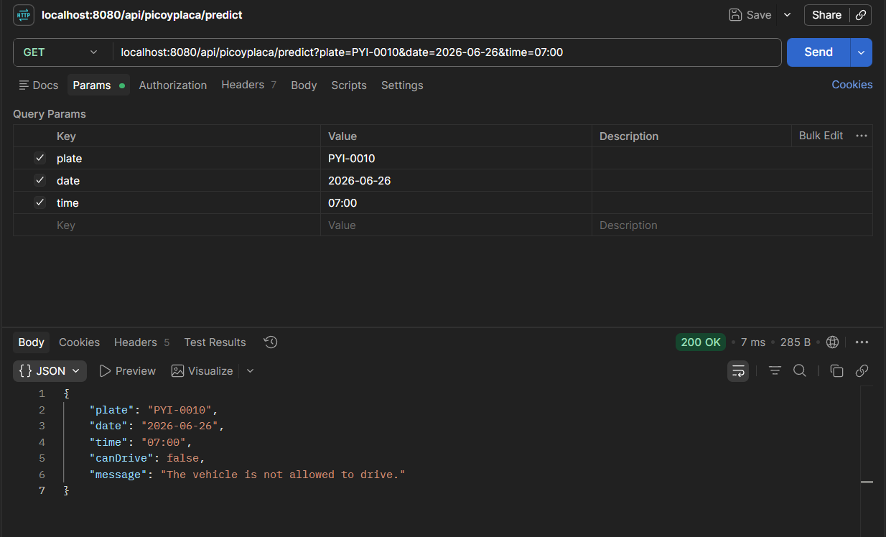

# Pico Y Placa Predictor [V1.0.0]

This "Pico y Placa" predictor was built using Java 17 and Spring Boot. It's used to verify either Car or Motorcycle Ecuadorian plates.

## Requirements

- **Docker** (Optional, easy to run)
- **Java 17**

## Build and run with Docker (Recommended)

1. Build the image using:
```
docker build -t pico-y-placa-backend .
```
2. Start the container natively on port `8080`:
```
docker run -p 8080:8080 pico-y-placa-backend
```

## Running the Application Locally (No Docker)

To start the application locally:
```
./mvnw spring-boot:run
```
The server will start on port 8080.

## API Usage

The application exposes a single endpoint:
`GET /api/picoyplaca/predict`

**Query Parameters:**
- `plate`: The vehicle's license plate (e.g., `PBX-1234` for cars or `AB123C` for motorcycles)
- `date`: The date formatted as `yyyy-MM-dd`
- `time`: The time formatted as `HH:mm`

**Example Request using Postman:**


**Example Request using curl:**
```
curl "localhost:8080/api/picoyplaca/predict?plate=PYI-0010&date=2026-06-26&time=07:00"
```


**Example Response:**
```
{
  "plate": "PYI-0010",
  "date": "2026-06-26",
  "time": "07:00",
  "canDrive": false,
  "message": "The vehicle is not allowed to drive."
}
```

**Run Tests:**
Use the command:
```
./mvnw test
```